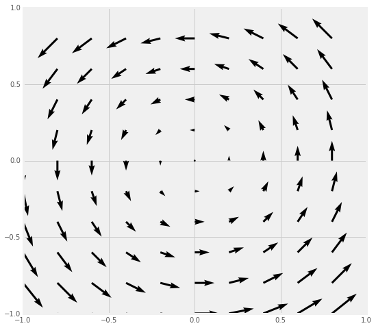
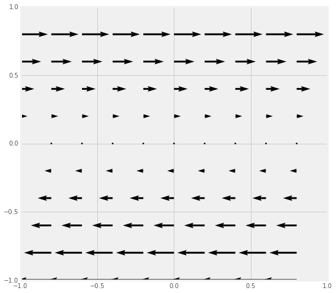
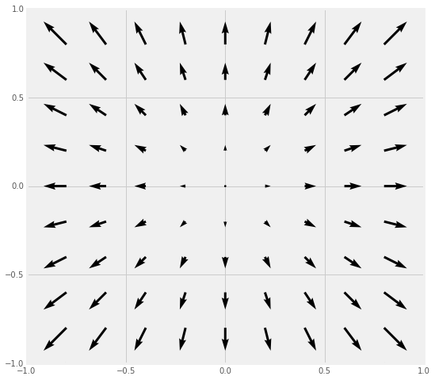
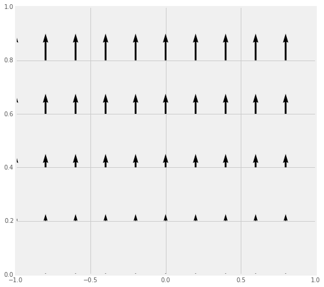

<h3 style="color:purple">This homework is tentative until this message is removed.</h3>

Preface: Homework in this class is a very large part of the learning experience (and a large fraction of your grade!). The homework might look long, but that is because it not really serving as a check on whether you are getting things from lecture. It meant to help you learn the material, the importance of different aspects of the material, and the implications of the material on your future work. So there will typically be longer descriptions in the problem statements. The work you are being asked to do is no longer than a standard lecture course, but the kinds of questions might be different. We strongly encourage you to work together (and with Dennis and Danny) on these homework problems, but you must turn in your own work.

# Homework 1 (Due September 9th)

Homework 1 emphasizes the mathematical formalism and related thinking that you will draw on in class. This homework focuses on Sections 1.1-1.4 of Griffiths, which covers differential, integral, and vector calculus. It also serves as an introduction to using [Jupyter notebooks](http://jupyter.org), which you will use on most homework assignments. With regard to computation on this homework, you will be using the [sympy](http://sympy.org) library, which allows you to perform symbolic manipulations (like Mathematica), and the [matplotlib](http://matplotlib.org/) library, which allows you to plot different kinds of figures. For this homework, there are several videos that you can draw on (referenced below) to help you.

#### 1. Reminders of Integrals Past
In this course, you will perform lots of different kinds of integrals, some of which you might have done in previous courses. In this problem, we will just dust off some of those integration techniques. You will need to explain key steps of the integration for each one, not simply do the mathematics.

1. Line (or path) integrals - These integrals are important for thinking about energy. Determine the work done by the vector force \\(\mathbf{F} = y^2\;\hat{x} - 2x^2\;\hat{y}\\) along the parabolic path \\(y=x^2\\) from (0,0) to (2,4). This path is restricted to the x-y plane and recall that \\(W=\int \mathbf{F}\cdot d\mathbf{l}\\).
2. Surface integrals - Calculating the flux over a particular surface is a very common way of determine the electric field. Evaluate the integral \\(\int_S \mathbf{v}\cdot d\mathbf{A}\\) where \\(\mathbf{v}(x,y,z) = 2x\;\hat{y} + 2y\;\hat{z}\\) and \\(S\\) is the rectangular surface lying in x-y plane from (0,0) to (1,5). Choose the direction of \\(+\hat{z}\\) to be indicative of positive flux.
3. Volume integrals - It will be common for you to determine the amount of total charge in a situation where the charge is distributed in space according to some function. You might be familiar with this concept from the perspective of distributed mass. Consider two different spheres: one with uniform mass density, \\(\rho_0\\), and the other with a radially varying density, \\(\rho(r)=\frac{\rho_0}{2R^2}r^2\\). If both spheres have the same radius \\(R\\), which has more mass?

#### 2. What can be done to a scalar function?
Given the scalar function \\(T(x,y,z)\\) (e.g., the temperature at any point in the room), which of the three operations (div, grad, and/or curl) can be sensibly operated on \\(T\\)? For each which can:

1. give a formula for the result,
2. explain in words how you would interpret the result, and
3. identify if the result a vector or scalar.

#### 3. What can be done to a vector function?
Given the vector function \\(\vec{V}(x,y,z)\\) (e.g., the velocity of a flowing fluid), which of the three operations (div, grad, and/or curl) can be sensibly operated on \\(\vec{V}\\)? For each which can:

1. give a formula for the result,
2. explain in words how you would interpret the result, and
3. identify if the result a vector or scalar.

#### 4. Determine the gradient of a scalar function and check it with computational tools
In Griffiths, \\(\vec{\mathfrak{r}}\\) represents the separation vector between source charges \\(\langle x', y', z' \rangle\\) and the field point -- location of test charge -- \\(\langle x, y, z \rangle\\). The separation vector is a **critcally important** vector in electrodynamics as it underlies all of the mathematical models that describe how source charges produce electric and magnetic fields. To that end, you will often do some mathematical manipulations of the separation vector. You are asked to perform two common manipulations below.

1. Calculate the gradient of the magnitude of the separation vector (i.e., \\(\nabla\|\vec{\mathfrak{r}}\|\\)) and the gradient of the inverse of the magnitude of the separation vector (i.e., \\(\nabla \dfrac{1}{\|\vec{\mathfrak{r}}\|}\\)) and show the gradients of these functions can be written as functions of the separation vector (\\(\vec{\mathfrak{r}}\\)) and/or its magntiude (\\(\|\vec{\mathfrak{r}}\|\\)). (*Hint: it might be easier to do this by explicitly writing out the function in Cartesian coordinates.*)
2. After determining the gradients of each of these functions by hand, [download this Jupyter notebook](../jupyter/HW1-GradientProblem.ipynb) (you can [view it here](https://github.com/dannycab/phy481msu/blob/gh-pages/jupyter/HW1-GradientProblem.ipynb)), which demonstrates how to calculate gradients using the [sympy](http://sympy.org) library for Python. Working through the notebook, use it to check the work you did by hand. Do you get the same answers?

**Important: In this class, we are strongly encouraging you to use the tools of modern science (i.e., computing) in a responsible way. This problem demonstrates that you may want to use Python and sympy to check the work that you have done analytically.**

#### 5. Analyzing divergence and curl visually
Calculating the divergence and curl of a vector field analytically is possible when the field is a well-known function (e.g., \\(\vec{V}(x,y,z)\\)). However, it will not always be the case that you know the function that generates the vector field.For example, in experimental fluid mechanics, measurements of the velocity field are done by tracking individual particles (called "tracers") that move in the field.

[Tracer Video Example](https://www.youtube.com/watch?v=hzvFHrWQbP0)

The displacement of those tracers is used to numerically reconstruct the velocity field of the fluid (by way of numerical derivatives), which usually does not conform to a known function. However, it is important to know if the flow has divergence or curl overall or at specific points as the models for fluid flow that are used to analyze the velocity field strongly depend on these results. Hence, visual inspection of a field (in our case, electromagnetic fields) is an important tool to understand which models might be used to analyze the field. This will be exceedingly important in our distinction between electric and magnetic fields as well as when the fields begin to vary with time.

For each of the four vector fields sketched below:

1. Which of them have a nonzero *divergence* somewhere? (If the divergence is nonzero *only* at isolated points, which point(s) would that be?)
2. Which of the following fields have nonzero *curl* somewhere? (If the curl is nonzero *only* at isolated points, which point(s) would that be?)
3. Provide a brief explanation for each of your answers above.

|||
|:-:|:-:|
| Field A | Field B |
|  |  |
| Field C | Field D |
|  |  |

#### 6. Plotting vector functions with `matplotlib`
Physics is both a mathematical and visual science. It is important to develop the ability to sketch and plot figures of various types. For the early part of this class, plotting the field generated by electric charges is important to understanding the field itself. In this problem, you will learn to use the [`matplotlib` library](http://matplotlib.org) to [plot vector fields](http://matplotlib.org/examples/pylab_examples/quiver_demo.html). As with the previous computational problem, you can [download this working Jupyter notebook](../jupyter/HW1-VectorFieldsProblem.ipynb) ([view it here](https://github.com/dannycab/phy481msu/blob/gh-pages/jupyter/HW1-VectorFieldsProblem.ipynb)), which describes how this kind of plotting is done for a specific case (\\(\vec{v}(x,y)=y\hat{x}\\)).

It will be up to you to plot additional figures for these cases:

1. \\(\vec{v}(x,y)=r\hat{r}\\) (where \\(\vec{r}\\) refers to the usual \\(\vec{r}\\)in spherical coordinates.)
2. \\(\vec{v}(x,y) = \dfrac{x}{\sqrt{x^2+y^2}}\hat{x}+\dfrac{y}{\sqrt{x^2+y^2}}\hat{x}\\)
3. \\(\vec{v}(x,y) = \hat{\phi}\\) (where \\(\\phi\\) is the usual plane-polar coordinate.)
4. For each case above, can you describe a physical situation where the field would be applicable?

#### 7. Vector proofs can be incredibly useful
In electromagnetism, developing a deep understanding of vector mathematics can facilitate a deeper understanding of the physical systems that we will investigate. While we will rarely ask you to prove relationships outright, knowing how certain proofs are done can often help you simplify a complicated problem. For example, in this problem, you will learn how we often use general vector operations with unspecified surfaces to make general statements about the field. In Griffiths, you read about a few integral theorems: the gradient theorem, Gauss's theorem (for divergences), and Stokes' theorem (for curls). You will make use of those theorems to prove a few things you have some intuition about from vector calculus.

1. From vector calculus, you know that the curl of any gradient of any scalar field is zero (i.e., \\(\nabla \times \nabla T(x,y,z) = 0 \\)). Use the corollary of the gradient theorem, namely that closed loop integral of any gradient of a scalar field is zero (\\(\oint \nabla T\cdot d\mathbf{l} = 0\\)), along with Stokes' theorem (\\(\int_S(\nabla \times \mathbf{v})\cdot d\mathbf{a} = \oint_C \mathbf{v}\cdot d\mathbf{l}\\)) to demonstrate that the curl of a gradient is zero. What is the essential argument that needs to be made that proves that the result is generalizable to any situation? (*Hint: The surface (S) and thus the line (C) that bounds the surface are not specified.*)
2. What does your result from the previous question tell you about possibility of swirly-ness of the gradient of a temperature field (\\(\nabla T\\)) over any specified surface?
3. From vector calculus, you know that the divergence of the curl of any vector field is zero (i.e., \\(\nabla \cdot (\nabla \times \mathbf{v}) = 0\\)). Use the corollary of Stokes' theorem, namely that the closed surface integral of the curl of a vector field is zero (\\(\oint_S (\nabla \times \mathbf{v})\cdot d\mathbf{a} = 0 \\)), along with the divergence theorem (\\(\int(\nabla \cdot \mathbf{v}) d\tau = \oint_S \mathbf{v}\cdot d\mathbf{a})\\)) to demonstrate that the divergence of a curl is zero. What is the essential argument that needs to be made the proves the result is generalizable to any situation? (*Hint: The volume (V) and thus the surface (S) that bounds it are not specified.*)
4. By doing these two proofs, what do you feel like you learned about vector calculus that you didn't already know?
