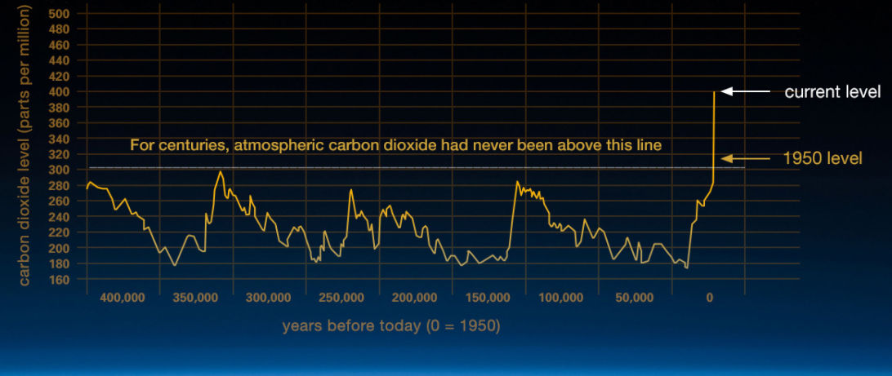
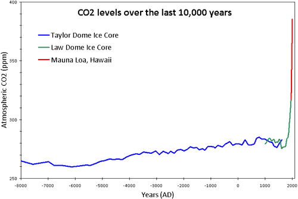
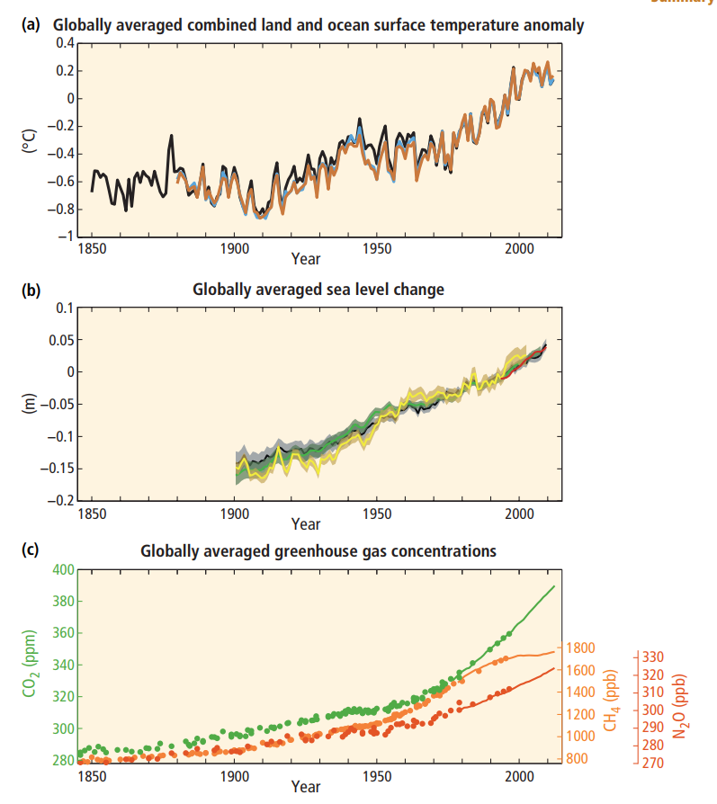
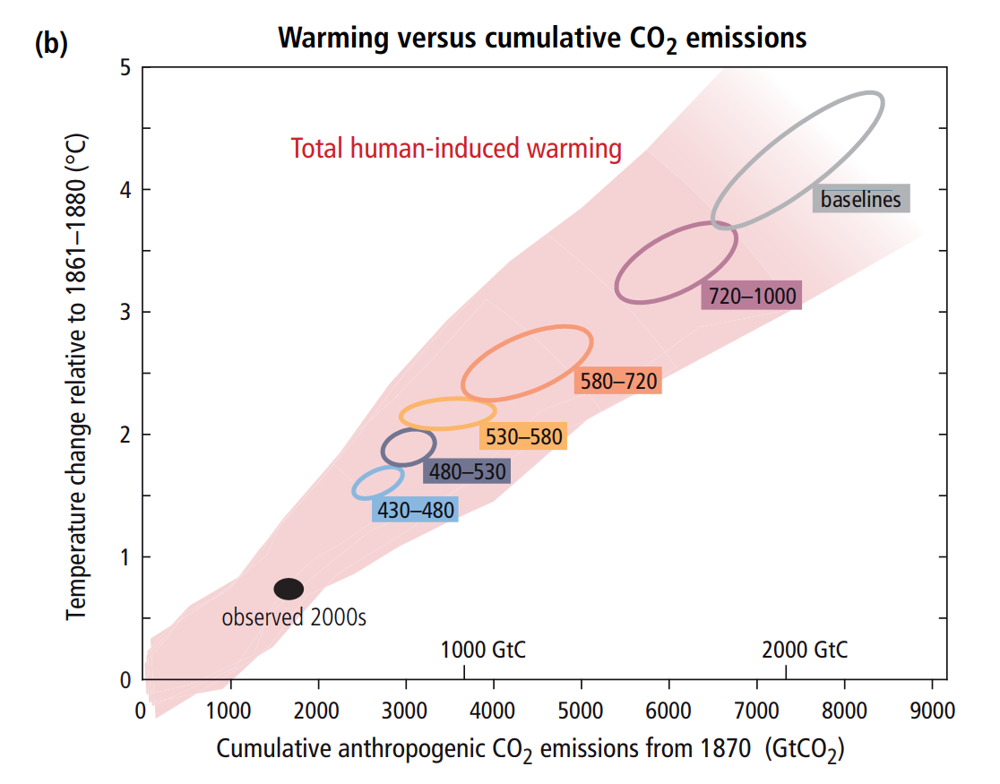
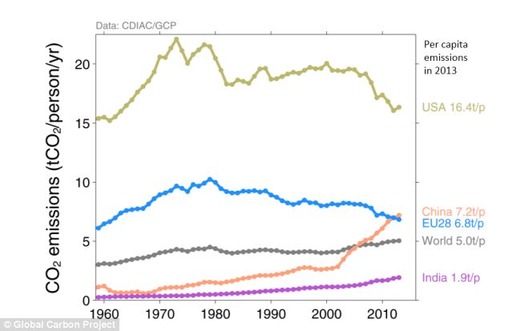

Here are the notes on climate change. 

## The greenhouse effect

Remember this chart from the *Lecture Tutorials*?

 

This gives the absorption of Earth's atmosphere as a function of wavelength. Visible light pass through, but many wavelengths of infrared are blocked by molecules like water and carbon dioxide. 

Since the Sun emits mostly visible thermal radiation (because it is so hot), and the Earth emits infrared radiation (because it is cooler), this means that the *Sun's energy can get in*, but the outgoing radiation from the Earth has trouble getting *out*; this has the effect of increasing the Earth's temperature. This is the key idea: if you don't understand why gases that absorb infrared increase the temperature of a planet, go back and look at the section on the greenhouse effect in the *Lecture Tutorials*.

This is demonstrated in dramatic fashion on Venus. Its atmosphere contains an enormous amount of carbon dioxide, which strongly absorbs infrared radiation; thus, the thermal radiation that would otherwisse carry thermal radiation away from Venus (cooling it down) can't get out. This means that Venus is more than 400 K warmer than the calculation you did in lab predicted.

Earth has a weaker greenhouse effect. We have only small amounts of water and carbon dioxide in our atmosphere, and so our greenhouse effect warms our planet only by 25 K or so.

Thus, the level of these gases -- carbon dioxide, water vapor, and methane, along with a few others -- affect the temperature of Earth.

## The history of Earth's climate

Earth's climate has seen a lot of variation over the years. Here's a rough plot of Earth's temperature -- note that the x-axis is not a uniform scale!

 

A few things to note here, working from right (the present) to left (the distant past):

* The horizontal black line indicates the temperature difference from the early modern (i.e. 1960-1990) average.
* For the last ten thousand years, Earth has been ca pretty consistent temperature.
* From 20,000 to 10,000 years ago, Earth's climate warmed steadily. 20,000 years ago, we were about 5 degrees Celsius colder than we are now: this is the last *ice age*.
* Over the last million years, Earth has seen a continuous cycle of ice ages (extended cold periods) -- we have around 90,000 years of steady cooling, followed by an *interglacial* warm period of around 10,000 years. We are currently in one of those warm periods, and have been for about 10,000 years. (This means that the next *natural* change in the climate would likely be a gradual return to another ice age.) The coldest part of the ice ages (20,000 years ago) are about 5 degrees C colder than the warm periods (now).
* Millions of years ago, the Earth was substantially warmer than it is now, at some points warmer by over 10 degrees C. This is the climate of the dinosaurs, where sea levels were hundreds of feet higher than they are now.

By looking at the history of our climate, we can thus get a rough scale of the kinds of climate conditions Earth can produce. All of these temperatures are relative to the 20th century average:

* -33C: complete absence of greenhouse effect; where we'd be without our atmosphere
* -10C: "Snowball earth": glaciers cover entire planet except a small band around the Equator
* -5C: ice age; Syracuse covered by glaciers; the climate during the human diaspora out of Africa
* 0C: our familiar climate
* +5C: ??? (but perhaps our near future...)
* +10C: climate during the time of the dinosaurs; much of America underwater

### Climate drivers

These natural changes to Earth's climate come from multiple sources. The most prominent recent climate effect is the ice age cycle; this is caused by predictable and calculable variations in Earth's orbit. Note that the time axis is so large that the industrial revolution -- which is causing *artificial* climate change due to CO2 emissions -- is not even on the graph. Other large changes, however, are slow -- they happen over millions of years. 

### Positive and negative feedback

If the Earth's temperature warms a little bit, many things will change on its surface. 

Some of them will tend to magnify that small change, further warming the Earth. For instance, white snow tends to reflect light away, while dark ground or water absorbs sunlight and heat up. (Everyone in Syracuse is familiar with the fact that snow-piles take longer to melt because they don't absorb sunlight!) We call these mechanisms **positive feedback**: a small change leads to larger changes.

Other mechanisms go in the other direction. If CO2 is released into the air, this will warm the Earth, but over time, the oceans will absorb that CO2, bringing CO2 levels and the temperature back down slowly. This is called **negative feedback**.

In the short term, though, the positive feedback wins out. This means that *small changes to the Earth's climate are magnified*. Some people argue that CO2 levels are not enough on their own to cause significant warming; they omit the fact that positive feedback mechanisms -- snow melting, water evaporating (since water vapor is also a greenhouse gas), and even the release of methane trapped under the Siberian permafrost -- will exaggerate any direct temperature changes due to CO2 levels.

This idea is not new. The very large positive feedback from increased water vapor in the air was first discussed by 
the Swedish scientist Svante Arrhenius in 1896, who calculated that the burning of coal would result in the Earth
becoming warmer. In fact, Arrhenius -- coming from a very cold place and not fully understanding the challenges faced
by people in warmer latitudes -- suggested that this would be a good thing, since it would let people grow more food!

CO2 levels in the Earth's atmosphere have fluctuated quite a bit over millions of years, since they are also affected by the temperature; they were quite low during the Ice Ages and quite high during the time of the dinosaurs. *It is very unlikely that human CO2 emissions will turn Earth into a world like Venus* -- we will, at most, push Earth's climate out of the cycle of ice ages and nudge it -- very rapidly! -- into something closer to the climate during the time of the dinosaurs.

### The modern history of CO2 levels

 

During the ice age cycle, CO2 levels bounced between 180 parts per million and 300 ppm. The cause-and-effect is not clear; most likely, small influences from the cycles in Earth's orbit caused larger changes in the climate, and rising/falling CO2 levels were part of the positive feedback that made this happen. However, in the geological blink of an eye, human burning of fossil fuels (natural gas, coal, and oil) has raised CO2 levels above 400 ppm -- levels that we've not seen in over a million years. This can't help but have a large effect on the climate! Here's a more dramatic plot of this over the last 10,000 years:

 

### We've seen this once before!

Geologists have noticed something called the "Paleocene - Eocene Thermal Maximum", or PETM: a period of thousands or tens of thousands of years (very sudden, in geologic time!) that was around 7 C warmer than the surrounding times; this happened around 56 million years ago. We see other signs of a spike in atmospheric CO2 at the time: something released a great deal of CO2 into the air. (We don't know what; this might have been the explosion of a huge amount of methane beneath the surface, or some volcanic activity.) 

This sudden release of CO2 caused the Earth to warm for thousands to tens of thousands of years. It caused a mass extinction of life deep in the oceans and large changes to surface life, as plants and animals died out in response to the sudden climate change.

Here, in the geological record, is something comparable to what we are doing: a sudden release of a great deal of CO2. And we can study its effects: around ten thousand years of a climate suddenly warmer by around 7 C, along with a massive change in life on Earth.

### Modern data

When we look at modern data on atmospheric CO2 levels, along with temperatures and sea levels, the correlation is very clear: as CO2 levels rise from the burning of fossil fuels, sea levels are rising (around 15 cm since 1900) and the temperature is increasing (around 1C since 1900). That last is important: **around one degree Celsius of warming has already taken place**.

 

I've omitted a lot of other datasets that were in the lecture notes, showing many other forms of change on Earth's surface that relate to warming: a decrease in the extent of glaciers and of Arctic sea ice, increased temperatures in specific parts of the atmosphere, and increased humidity.

It is the *overwhelming* consensus of climate scientists from around the world that climate change is happening and that it is due to human CO2 emissions. The consensus report from the Intergovernmental Panel on Climate Change wrote in 2014:

* "Anthropogenic greenhouse gas emissions have increased since the
pre-industrial era, driven largely by economic and population growth,
and are now higher than ever. This has led to atmospheric
concentrations of carbon dioxide, methane and nitrous oxide that are
unprecedented in at least the last 800,000 years. Their effects,
together with those of other anthropogenic drivers, have been
detected throughout the climate system and are extremely likely to
have been the dominant cause of the observed warming since the
mid-20th century. "

## The likely future

How much total warming we get depends on the total amount of carbon dioxide we release from burning fossil fuels. These sorts of projections can be quite fuzzy, but the people who do them are very good at judging their level of confidence in predictions. I, personally, am something of a stickler for rigor in statistics in research, and I am *incredibly* impressed by the thoroughness that the IPCC scientists took in ensuring that they accurately represented the confidence of their predictions and their margin of error.

Here are their data:

 

The thing to note here is that the total amount of warming (vertical axis) could vary a great deal, depending on how much total carbon dioxide we release (horizontal axis). The "baselines" ellipse is what will happen with no changes in how we approach fossil fuels; the other ellipses represent varying degrees of action to reduce the use of fossil fuels. Some things to note:

* **One degree Celsius** of warming has already happened.
* We are in for **5 degrees Celsius of warming**, which would *increase* our temperatures as much as the Ice Ages *decreased* them, if we do nothing
* Action on climate change -- limiting fossil fuel use -- can reduce this number. These reductions will be more effective and involve less dramatic economic shocks if they're undertaken *quickly*; right now economists and scientists think we could hold warming to **2 degrees Celsius** with prompt, but not drastic, action.

Note that "global warming" does *not* mean an end to cold weather. We are discussing an overall warming of the planet by a few degrees, which is sufficient to cause drastic effects -- changes in weather patterns that farmers in developing countries rely on, the southerly expansion of the Sahara pushing many farmers off of their land in central Africa, and a rise in sea levels that could flood coastal cities. The existence of cold weather in various places *does not* mean that climate change is not happening.

It's important to note that these sorts of changes in the climate have happened historically (the ice ages). What's different here is how *quickly* they will happen -- over a mere hundred years or so. This will cause massive disruptions in human living patterns. Life on Earth will go on -- but many people will lose their homes, and many (especially in the developing world) will die from famine.

## Sources of CO2 emissions

The people responsible for burning all of this CO2 are, collectively, the global wealthy: Americans, Europeans, Japanese, Australians, and so forth. Here's a plot of per-capita emissions for some of the world's largest countries/regions:

 

A cautionary note: it is tempting to look at this graph and say "Wow! The Chinese have really started to use a lot of fossil fuels! But the USA is getting better!" Be *very careful* here when pointing fingers. Many wealthy countries, like the US and France, are moving away from industrial economies -- we manufacture a lot less stuff than we used to. But countries like China and India are industrializing rapidly, and export many of their products to places like the USA. So it is *absolutely not fair* to blame China for using fossil fuels when those fossil fuels are used to produce products that we buy. Ours is a global economy: I am typing this on a laptop designed by Americans, with a CPU designed by Americans and Israelis, running software made by South African company, and built in China with Chinese aluminum. **Ours is a global economy; climate change is a global problem**.

It is certainly true, however, that wealthy countries have gotten *most of the benefit* from burning fossil fuels (since they industrialized first), while developing countries stand to incur most of the *harm* from climate change (since their people have fewer resources to mitigate its effects). Some people argue that this has created a "climate debt", owed by wealthy nations to poorer ones, to help fix the problem that the wealthy nations (mostly) created. 

## Doing something about this

There are two main places where fossil fuels get used. The largest is in electrical power generation (coal, natural gas); the second largest is in transportation (jet fuel, gasoline and diesel for cars). Any solution to climate change must involve reducing these sources.

The central problem is the **tragedy of the commons**. Burning fossil fuels can benefit the people who use them a lot -- gasoline for cars, coal for power, and so on. However, if we want to do something about climate change, there is only a limited amount of fossil fuel we can burn. Right now, there is no consequence for people using this limited resource; this is called the "tragedy of the commons" in economics. 

There are multiple solutions to this. Climate change is often made into a political or ideological issue, but it doesn't have to be: there are ways to address fossil fuel overuse based on both liberal/progressive and conservative/libertarian economic ideas. For instance, many progressive solutions center around government subsidies to clean energy and the use of regulation to disallow certain inefficient uses of fossil fuels, while many conservative/libertarian solutions propose adding an extra cost to burning fossil fuels and thus allowing market forces and price signals to reduce their use.

Any discussion of which solutions are better, or even whether addressing climate change is worth it at all, is outside the realm of science. (For what it's worth, I believe it is absolutely worth addressing urgently -- but I am not an expert in economics and don't know which solutions are likely to be best.) This is outside the scope of these notes and this course -- here I must hang up my hat and allow the political science and economics majors to take over!

## Summary

* The levels of carbon dioxide, methane, and water in the Earth's atmosphere control the strength of its greenhouse effect and thus its temperature
* There have been natural variations in the levels of these gases, caused by the slow drift of feedback loops and geological activity over many millions of years
* These variations are responsible for the changes in the climate since the age of the dinosaurs; the climate then was about 10C warmer than now
* During the last million years or so we've seen a cycle of ice ages, initially caused by orbital cycles but amplified by feedback with the greenhouse effect; the difference between an ice age and the present climate is about 5C
* Atmospheric CO2 closely tracks the historical temperature of the Earth
* 55 million years ago there was a sudden release of CO2, similar to what we're doing today
* It caused the earth to warm by around 5C for thousands to tens of thousands of years, causing major changes in the life patterns of plants and animals
* Recently humans have greatly increased the level of CO2 in the Earth's atmosphere to levels that haven't been seen for millions of years
* This has already caused the earth to warm by about 1C
* This warming effect is amplified in the Arctic due to the feedback between melting ice and the increased absorption of sunlight
* This will change local climate patterns and cause sea levels to rise, greatly disrupting life for many people and ecological communities
* Warming of about 1.5C is likely to happen even with immediate drastic action
* Depending on how quickly we continue to act to mitigate CO2 emissions, we may be in store for warming of up to 5C over the next century
* The overwhelming scientific consensus supports this picture; the only serious dispute is in the details.
