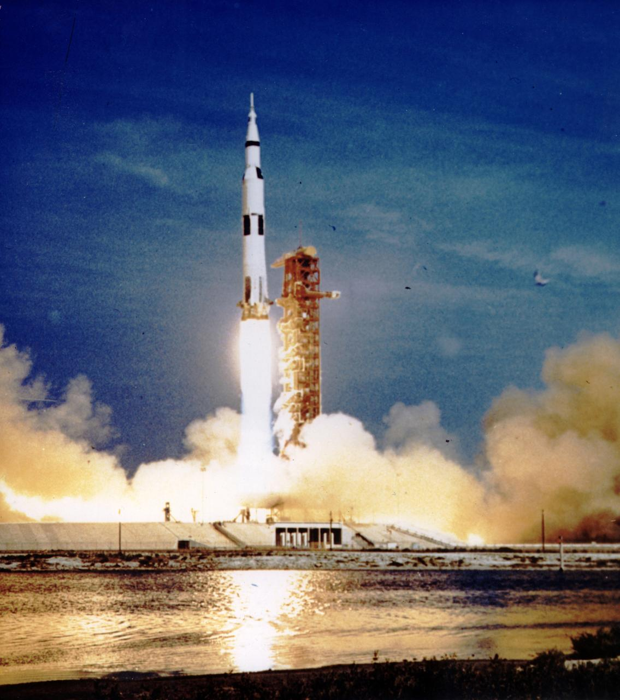

Current lecture slides: [Ad astra per aspera, II!](slides/lecture25/lecture25.pdf)

[Notes on climate change](climate-change.html)

[Statement on campus climate and vandalism](2019-statement.html)

<h4>
<a href="https://join.slack.com/t/suphysics/shared_invite/enQtNzI2MzU4NzU5NDI2LWMxZWE2MmYzMjVmZGMzZWU5ZDk5OWFkYjMyMmI5ZGIyZDBkMDZiMjFmY2YzYWY1Y2U5ODY3ZDNlNDhmMDczMzk">Invitation link to course Slack team</a>
</h4>
**Announcements:**

Audiorecording from Tuesday, November 19th's class: [2:00](https://mega.nz/#!kYkRXYTI!b_dHcVmLkjBesEiVo501UxDIE-L2QNABtcNooicuKnE)

Audiorecordings from Thursday, November 14th's class: [12:30](https://mega.nz/#!4REUSIBC!oz7zxJqSLtgqPt19Uy5YSMfFzx2lPzUYucu3AjmGgQY) [2:00](https://mega.nz/#!4REUSIBC!oz7zxJqSLtgqPt19Uy5YSMfFzx2lPzUYucu3AjmGgQY). I will transcode these into mp3 and Opus when I get a chance.

---

[Forgot your response cards?](cards.html)

---

Pending ask-the-physicist questions:

<!-- Cal Parker asks: Does the universe have an edge? -->

<!-- Dmytro Kuchirka asks: I have a question regarding the velocity of Earth. If it was increased to the speed approximate to the simulation you showed in class how would it affect life on Earth and what changes could mankind and Earth experience? -->

<!-- Paritosh Jain asks: what is a neutron star? 

Chris Ruan asks:  I know the earth, moon, stars,etc are moving, but does the Milky Way Galaxy also moving? In which direction? Move towards where? How does the whole universe travel?

Harris Krahn asks: At what point does spaghettification occur?

Shannon Kirkpatrick asks: I read somewhere that our solar system is moving through the universe in a helix... is this true? And if so, how does this work? 

Elise Newhouse points out: When we were looking at the Milky Way in all its different light emissions, you mentioned not knowing what the really bright spot was on the x-ray and gamma ray images.  I think its the Vela Pulsar!

Brandon Decato asks: I have an ask a physicist question that my friends and I were debating late Sunday night while playing video games. If I had a twin born at the exact same time as me, and at the age of 5 I was separated from him, put into a spaceship that travelled near the speed of light, and was gone for what to me was 5 years, would I be younger than my twin brother? If this is true, would my body still age at the same rate as my twin on earth, aka I would have the mind of a 10 year old but the body of an 87 year old? Would it age the same way as a normal human ages from 5-10?

Alex Wyers asks: In *Star Wars*, the planet Tatooine has two suns. Besides making the planet incredibly hot all the time, what other effects might this have on the planet, and have we observed any solar systems in the real world with two suns similar to Tatooine?

-->

Abigail Cramer asks: Will [global warming] affect the air outside of our atmosphere and since molecules move faster in a heated environment, will this change overall cause more “things” to enter our atmosphere leading to higher risk of issues related to the things. Does that make sense, basically, will our beat impact the asteroids and space things outside and potentially cause them to move in a way that will negatively impact our species and life on this planet? Yet another reason to work on climate change if so...

Katherine Nehring asks: Since Earth transfers the slightest rotational angular momentum (stated in the textbook), will that affect global warming or climate change at all if the rotation of the Earth is slowing down?

 

---

 

 
 
