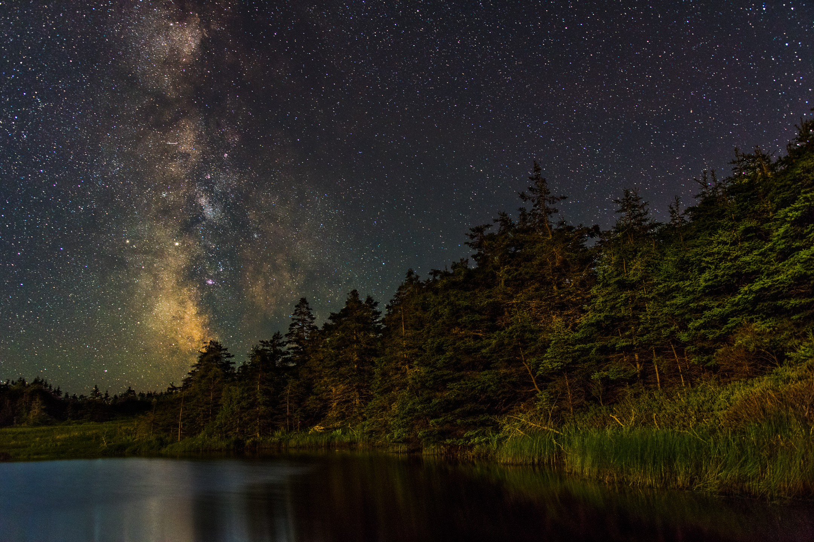

<h4>
<a href="https://join.slack.com/t/suphysics/shared_invite/enQtNzI2MzU4NzU5NDI2LWMxZWE2MmYzMjVmZGMzZWU5ZDk5OWFkYjMyMmI5ZGIyZDBkMDZiMjFmY2YzYWY1Y2U5ODY3ZDNlNDhmMDczMzk">Invitation link to course Slack team</a>
</h4>
**Announcements:**

<a href="https://docs.google.com/forms/d/1rpQp2BBb1eWjyAl5x1-IiyVTdGMRIL0PO2O0tI2JvXE/">Suggest a question for Exam 1 and earn extra credit!</a>

---

<b>Here is last year's <a href="exam1.pdf">first exam</a></b>.

I will post an answer key and explanations Friday, after we review in class Thursday.

Current lecture slides: <a href="slides/lecture8/lecture8.pdf">The Moon, continued; exam review</a>   

[Forgot your response cards?](cards.html)

---

Pending ask-the-physicist questions:

Cal Parker asks: Does the universe have an edge?

Dmytro Kuchirka asks: I have a question regarding the velocity of Earth. If it was increased to the speed approximate to the simulation you showed in class how would it affect life on Earth and what changes could mankind and Earth experience?

Paritosh Jain asks: what is a neutron star?

 

---

 

 
 
<em>The Milky Way visible above a landscape lit by the rising Moon. Gabarus Wilderness Area, Nova Scotia, Canada. ISO 4000 or so, f/1.8, 15 second exposure.</em> 
