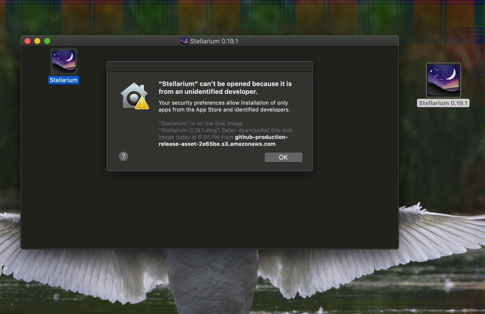
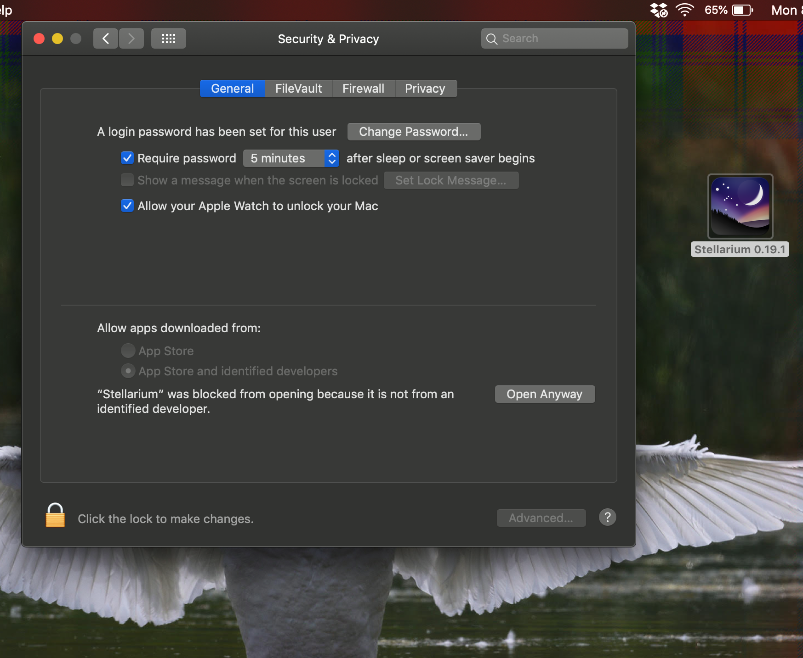

You are welcome to use the web version of Stellarium. But if you want to download it and run it (for better graphics and performance) and have an Apple 
computer, this may be interesting to you.

Apple has a security feature on Macs that makes it harder to run software that macOS doesn't recognize as signed by Apple.

However, Stellarium is safe, and so you'll want to say to your computer "Yes, I know this program isn't signed, but I want to run 
it anyway." 

I don't have a Mac. But a friend does, and she provided some instructions on how to install and run it.

  

First download Stellarium from <a href="https://github.com/Stellarium/stellarium/releases/download/v0.20.2/Stellarium-0.20.2.zip">
the publisher</a>, unzip the archive, and open the `.dmg` disk image.

When trying to open it, she got that error message saying that she couldn't open it because it isn't from a recognized Apple developer.

She then went into system preferences, then security and privacy. On the general tab, there is a section that says 
"allow apps downloaded from: App Store, App Store and identified developers".

Stellarium was flagged, and there was an option for "open anyway". After checking this option, it opened.

You will need to click the padlock icon and enter your computer's password to change this setting.

  

Thanks to Alice Lindsay for taking these screenshots and providing the instructions!

---

 

 
 
<em>The Milky Way visible above a landscape lit by the rising Moon. Gabarus Wilderness Area, Nova Scotia, Canada. ISO 4000 or so, f/1.8, 15 second exposure.</em> 
